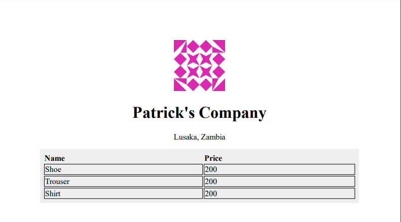

<h1 align="center">PDF Render App</h1>

## Before

Install this:

https://github.com/tschoonj/GTK-for-Windows-Runtime-Environment-Installer/releases/download/2021-04-29/gtk3-runtime-3.24.29-2021-04-29-ts-win64.exe

<h1>Usage
</h1>
To use this template to start your own project:

<h3>
Existing virtualenv</h3>

If your project is already in an existing python3 virtualenv first install django by running

<pre><code>$ pip install django
</code></pre>

    <clipboard-copy aria-label="Copy" class="ClipboardButton btn js-clipboard-copy m-2 p-0 tooltipped-no-delay" data-copy-feedback="Copied!" data-tooltip-direction="w" value="$ pip install django
" tabindex="0" role="button">
    </clipboard-copy>
  

 

After that just install the local dependencies, run migrations, and start the server.

<h1>Getting Started</h1>

First clone the repository from Github and switch to the new directory:

<pre><code>$ git clone git@github.com/USERNAME/{{ project_name }}.git
$ cd {{ project_name }}
</code></pre>

    <clipboard-copy aria-label="Copy" class="ClipboardButton btn js-clipboard-copy m-2 p-0 tooltipped-no-delay" data-copy-feedback="Copied!" data-tooltip-direction="w" value="$ git clone git@github.com/USERNAME/{{ project_name }}.git
$ cd {{ project_name }}
" tabindex="0" role="button">
    </clipboard-copy>
  

Activate the virtualenv for your project.

Install project dependencies:

<pre><code>$ pip install -r requirements.txt
</code></pre>

    <clipboard-copy aria-label="Copy" class="ClipboardButton btn js-clipboard-copy m-2 p-0 tooltipped-no-delay" data-copy-feedback="Copied!" data-tooltip-direction="w" value="$ pip install -r requirements/local.txt
" tabindex="0" role="button">
    </clipboard-copy>
  

Then simply apply the migrations:

<pre><code>$ python manage.py migrate
</code></pre>

    <clipboard-copy aria-label="Copy" class="ClipboardButton btn js-clipboard-copy m-2 p-0 tooltipped-no-delay" data-copy-feedback="Copied!" data-tooltip-direction="w" value="$ python manage.py migrate
" tabindex="0" role="button">
    </clipboard-copy>
  

You can now run the development server:

<pre><code>$ python manage.py runserver
</code></pre>

    <clipboard-copy aria-label="Copy" class="ClipboardButton btn js-clipboard-copy m-2 p-0 tooltipped-no-delay" data-copy-feedback="Copied!" data-tooltip-direction="w" value="$ python manage.py runserver
" tabindex="0" role="button">
    </clipboard-copy>
  

